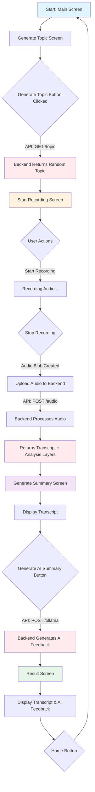

# 🎤 GDHelper - Group Discussion Helper

<div align="center">

**Improve Your Speaking Intelligence with AI-Powered Speech Analysis**

[](https://reactjs.org/)
[](https://vitejs.dev/)
[](https://mui.com/)
[](LICENSE)

[Backend Repository](https://github.com/Hunter69240/GDHelper-Backend) • [Report Bug](https://github.com/Hunter69240/GDHelper-Backend/issues) • [Request Feature](https://github.com/Hunter69240/GDHelper-Backend/issues)

</div>

---

## 📖 Table of Contents

- [Overview](#-overview)
- [Features](#-features)
- [How It Works](#-how-it-works)
- [Application Flow](#-application-flow)
- [Technology Stack](#-technology-stack)
- [File Structure](#-file-structure)
- [Getting Started](#-getting-started)
- [Environment Variables](#-environment-variables)
- [Backend Integration](#-backend-integration)

---

## 🎯 Overview

**GDHelper** is an intelligent web application designed to help users improve their public speaking and group discussion skills. The application generates random topics, records users' speeches, transcribes them using advanced speech-to-text technology, and provides comprehensive AI-powered feedback on delivery, topic focus, and reasoning structure.

This is the **Frontend** repository built with React and modern UI frameworks. The application communicates with a Python-based backend that handles audio processing, transcription, and AI analysis.

---

## ✨ Features

- 🎲 **Random Topic Generation** - Get instant discussion topics to practice on
- 🎙️ **Audio Recording** - Browser-based audio recording using MediaRecorder API
- 📝 **Speech Transcription** - Automatic speech-to-text conversion
- 🤖 **AI-Powered Analysis** - Multi-layer speech analysis including:
  - Delivery quality assessment
  - Topic adherence evaluation
  - Reasoning structure analysis
- 📊 **Detailed Feedback** - Comprehensive AI-generated feedback with markdown formatting
- 🎨 **Modern UI** - Clean, responsive interface built with Material-UI
- 🏠 **Easy Navigation** - Simple workflow with intuitive state management

---

## 🔍 How It Works

### Workflow Process

1. **Topic Generation**: The application fetches a random topic from the backend API
2. **Recording**: User records their speech on the given topic using their device microphone
3. **Audio Upload**: Recorded audio (WebM format) is sent to the backend along with the topic
4. **Transcription & Analysis**: Backend processes the audio through multiple analysis layers:
   - **Layer 1**: Speech-to-text transcription
   - **Layer 2-4**: Advanced linguistic and content analysis
5. **AI Summary**: Application sends transcript and analysis data to AI model (Ollama)
6. **Results Display**: User receives detailed feedback with transcript and AI recommendations

### Technical Implementation

- **State Management**: React hooks (`useState`) manage application state across 5 distinct screens
- **API Communication**: Axios handles HTTP requests to backend endpoints
- **Audio Handling**: Native Web APIs (MediaRecorder) capture and process audio
- **Rendering**: React components conditionally render based on application state
- **Styling**: Combination of Material-UI components and Tailwind CSS for responsive design

---

## 📊 Application Flow



---

## 🛠 Technology Stack

### Frontend Core
- **[React 19.2.0](https://reactjs.org/)** - UI library for building component-based interfaces
- **[Vite 8.0.0](https://vitejs.dev/)** - Next-generation frontend build tool
- **JavaScript (ES6+)** - Modern JavaScript with JSX syntax

### UI Framework & Styling
- **[Material-UI (MUI) 7.3.8](https://mui.com/)** - React component library
  - `@mui/material` - Core components
  - `@mui/icons-material` - Icon components
  - `@emotion/react` & `@emotion/styled` - CSS-in-JS styling
- **[Tailwind CSS 4.2.0](https://tailwindcss.com/)** - Utility-first CSS framework

### State Management & Data Handling
- **React Hooks** - `useState` for local state management
- **[Axios 1.13.5](https://axios-http.com/)** - Promise-based HTTP client

### Additional Libraries
- **[React Markdown 10.1.0](https://github.com/remarkjs/react-markdown)** - Markdown rendering for AI feedback

### Development Tools
- **[ESLint](https://eslint.org/)** - JavaScript linting
- **[@vitejs/plugin-react](https://github.com/vitejs/vite-plugin-react)** - React Fast Refresh support

### Browser APIs
- **MediaRecorder API** - Audio recording functionality
- **getUserMedia API** - Microphone access

---

## 📁 File Structure

```
Frontend/
├── public/                      # Static assets
├── src/
│   ├── assets/                  # Images, fonts, and other assets
│   ├── components/              # Reusable React components
│   │   └── Header.jsx           # Navigation header with home button
│   ├── pages/                   # Page-level components (screens)
│   │   ├── MainScreen.jsx       # Landing/welcome screen
│   │   ├── GenerateTopic.jsx    # Topic generation screen
│   │   ├── StartRecording.jsx   # Audio recording screen
│   │   ├── GenerateSummary.jsx  # Transcript display & AI processing screen
│   │   └── Result.jsx           # Final results and feedback screen
│   ├── services/                # API and external service integrations
│   │   └── api.js               # Axios instance configuration
│   ├── App.jsx                  # Root component with state management
│   ├── App.css                  # Application-wide styles
│   ├── main.jsx                 # Application entry point
│   └── index.css                # Global CSS styles
├── eslint.config.js             # ESLint configuration
├── index.html                   # HTML entry point
├── package.json                 # Dependencies and scripts
├── vite.config.js               # Vite configuration
└── README.md                    # This file
```

### Component Responsibilities

| Component | Purpose |
|-----------|---------|
| `App.jsx` | Main state container, routing logic, and screen rendering |
| `Header.jsx` | Top navigation bar with home/reset functionality |
| `MainScreen.jsx` | Welcome screen with app introduction |
| `GenerateTopic.jsx` | Fetch and display random topic from API |
| `StartRecording.jsx` | Handle audio recording and upload |
| `GenerateSummary.jsx` | Display transcript and trigger AI analysis |
| `Result.jsx` | Show final transcript and formatted AI feedback |
| `api.js` | Centralized Axios configuration with base URL |

---

## 🚀 Getting Started

### Prerequisites

- **Node.js** (v18 or higher)
- **npm** or **yarn**
- Modern web browser with microphone access
- Backend server running (see [Backend Repository](https://github.com/Hunter69240/GDHelper-Backend))

### Installation

1. **Clone the repository**
   ```bash
   git clone https://github.com/yourusername/GDHelper-Frontend.git
   cd GDHelper-Frontend
   ```

2. **Install dependencies**
   ```bash
   npm install
   ```

3. **Configure environment variables**
   
   Create a `.env` file in the root directory:
   ```env
   VITE_API_URL=http://localhost:5000/api
   ```

4. **Start the development server**
   ```bash
   npm run dev
   ```

5. **Open your browser**
   
   Navigate to `http://localhost:5173`

### Build for Production

```bash
npm run build
```

The optimized production build will be created in the `dist/` directory.

### Preview Production Build

```bash
npm run preview
```

---

## 🔐 Environment Variables

Create a `.env` file in the root directory with the following variables:

| Variable | Description | Example |
|----------|-------------|---------|
| `VITE_API_URL` | Backend API base URL | `http://localhost:5000/api` |

> **Note**: All Vite environment variables must be prefixed with `VITE_`

---

## 🔗 Backend Integration

This frontend application communicates with the GDHelper backend API:

### 🔗 [Backend Repository](https://github.com/Hunter69240/GDHelper-Backend)

### API Endpoints Used

| Endpoint | Method | Purpose | Request | Response |
|----------|--------|---------|---------|----------|
| `/topic` | GET | Fetch random topic | None | `{ "Topic": "string" }` |
| `/audio` | POST | Upload audio for transcription | FormData (audio, topic) | `{ "transcript": {...}, "layer_2": {...}, "layer_3": {...}, "layer_4": {...} }` |
| `/ollama` | POST | Generate AI feedback | JSON (topic, transcript, layers) | `{ "feedback": "string" }` |

### Backend Technologies

- Python Flask/FastAPI
- Whisper AI (Speech-to-Text)
- Ollama (AI Analysis)
- Audio Processing Libraries

---

##  License

This project is licensed under the MIT License.

---

## 🙏 Acknowledgments

- **React Team** - For the amazing React library
- **Material-UI Team** - For the comprehensive component library
- **Vite Team** - For the blazing-fast build tool
- **OpenAI Whisper** - For speech recognition capabilities
- **Ollama** - For local AI model integration

---

<div align="center">


[⭐ Star this repository](https://github.com/Hunter69240/GDHelper-Backend) if you find it helpful!

</div>
